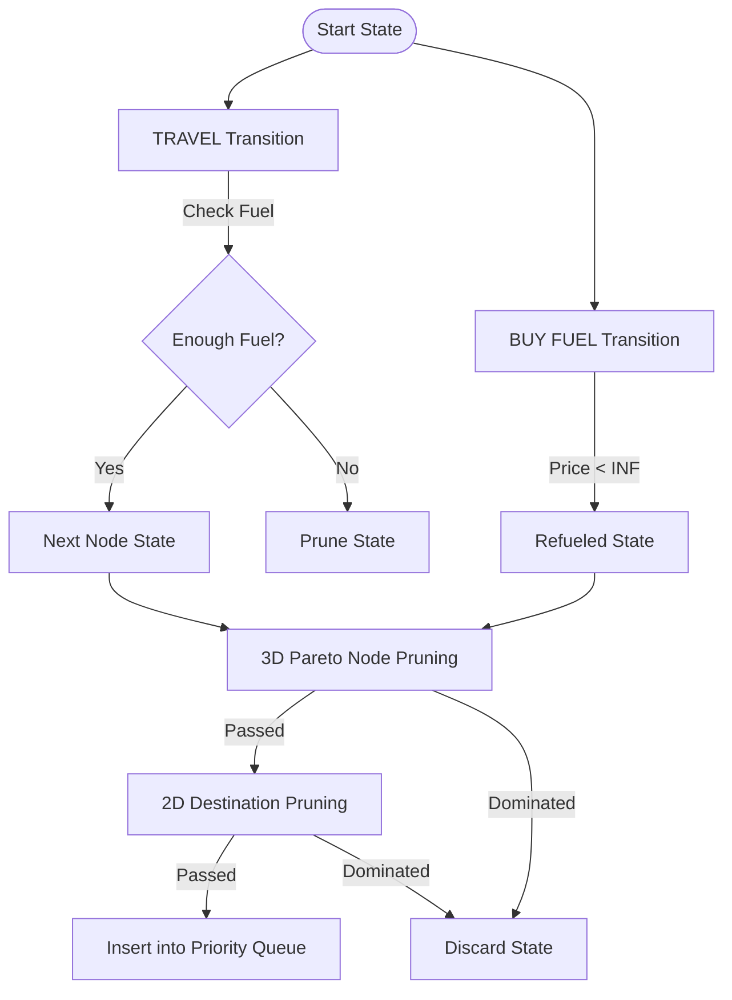

# 🚀 Uber Fuel-Aware Route Planner

### Multi-Objective Graph Optimization System (C++17)

A production-quality C++17 routing engine designed to solve the **Resource-Constrained Shortest Path Problem**. The engine optimizes two conflicting objectives: **minimizing total travel cost** (fuel purchases + tolls) and **minimizing total travel time**, while strictly adhering to vehicle fuel capacity constraints.

---

## 🧠 Core Algorithmic Framework

### 1. State Space Representation
The algorithm maps the physical network into a 3D state-space graph where search nodes represent the vehicle's dynamic state:
$$\text{State} = \big(\text{Node } (u), \text{ Fuel } (f), \text{ Cost } (c), \text{ Time } (t)\big)$$

### 2. Multi-Objective State-Space Dijkstra
Standard Dijkstra fails here because refueling decisions are state-dependent. We resolve this by running a modified Dijkstra over the state space with two transitions:
1. **TRAVEL**: Move to an adjacent node if $f \ge \text{consumption}$. Deduct fuel, add travel time and tolls.
2. **BUY FUEL**: Purchase fuel at the current node's price in increments of `fuel_step`. Cost increases; time increases by refueling overhead.



### 3. Pareto Optimization & Pruning Layers
To prevent state explosion, the engine implements two pruning filters:
* **Node-Level 3D Pareto Pruning**: At each node $u$, we maintain a frontier of non-dominated states. State $A$ dominates $B$ if:
  $$f_A \ge f_B \quad \text{and} \quad c_A \le c_B \quad \text{and} \quad t_A \le t_B$$
  Any dominated state is discarded before entering the Priority Queue.
* **Destination-Level 2D Pareto Pruning**: Any search state that has a cost and time dominated by an already completed path to the destination is pruned immediately.

---

## 🏗️ Project Architecture

```
├── CMakeLists.txt         # Build Configuration
├── input.txt              # Sample Configuration File
├── src
│   ├── main.cpp           # App Entry Point
│   ├── cli.h/cpp          # Interactive Terminal UI
│   ├── dijkstra.h/cpp     # State-Space Dijkstra Solver
│   ├── graph.h/cpp        # Graph Topology & File Config Parser
│   ├── input_validator.h  # Network & Query Validator Class
│   ├── fuel_manager.h     # Tank Constraints & Step Refueling Calculations
│   ├── pareto.h           # 3D & 2D Dominance Checking Logic
│   ├── tradeoff_analyzer.h# Pareto Frontier Normalization & Scoring
│   ├── json_exporter.h/cpp# Serialization for Map Visualization
│   └── tests.h/cpp        # Self-Validation Test Suite
```

---

## 🛡️ Input Validation & Safety

The engine includes an `InputValidator` class that parses input files and runtime queries, throwing `std::invalid_argument` exceptions to prevent program failures:
* Checks for negative fuel prices or negative tolls.
* Validates that node IDs remain within the valid range $[0, V-1]$.
* Checks that query parameters (source, destination, initial fuel) are valid.
* **Passability Check**: Automatically marks a route as impassable and rejects it if any road's fuel consumption exceeds the vehicle's total tank capacity.

---

## 💾 Custom Configuration Format (`input.txt`)

You can define custom nodes, prices, and queries in a comment-delimited config file:

```ini
// Format: Node1 Node2 FuelRequired TimeTaken [OptionalToll]
0 1 5.0 1.0
1 2 5.0 1.0
2 3 5.0 1.0
3 4 5.0 1.0

// Format: NodeID PetrolPrice
0 2.0
1 INF  # Node has no petrol pump
2 1.0
3 1.5
4 2.5

// Format: Source Destination TankCapacity [InitialFuel]
0 4 10.0 5.0
```

---

## 🚀 Building & Running

### Prerequisites
* A C++17 compatible compiler (GCC, Clang, MSVC)
* CMake 3.12 or newer

### 1. Compile the Project
```bash
cmake -B build -DCMAKE_BUILD_TYPE=Release
cmake --build build
```

### 2. Run Interactive CLI
```bash
./build/fuel_planner
```
* Select option `3` to load `input.txt`.
* Select option `1` to run optimization (accept `y` to pre-fill parameters from the loaded file).

### 3. Run Automated Tests
```bash
./build/fuel_planner --run-tests
```
